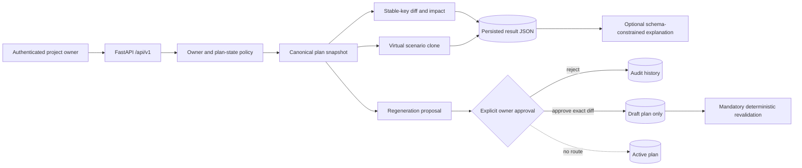
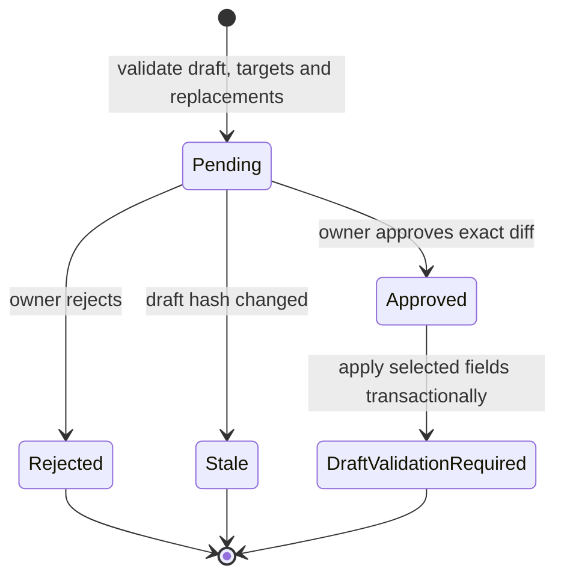
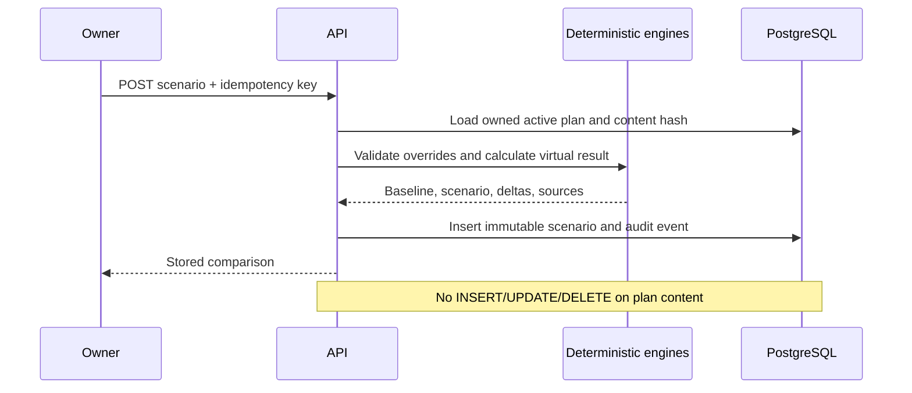

# Advanced Intelligence Architecture

Status: accepted for the Phase 11 release gate. Last reviewed: 2026-07-28.

## Outcome and boundaries

Phase 11 adds deterministic plan comparison, critical-path analysis, capacity forecasting,
selective regeneration, what-if scenarios, change impact, and grounded explanation contracts.
It does not add a write path to active plans. Rich dependency graphs, Gantt views, a dedicated
risk-register screen, PDF export, and the evaluation dashboard remain Phase 12.

The application owns every calculation and authorization decision. Model output may propose
selected draft field values or explain an already-computed result. It cannot choose the
baseline, expand the requested target set, rewrite a protected item, validate a graph,
calculate a date, accept a proposal, or mutate a plan.

## Persisted contracts

| Artifact | Ownership/version binding | Mutation rule | Idempotency/concurrency |
|---|---|---|---|
| `Scenario` | owner, project, active baseline version and baseline content hash | Append-only; PostgreSQL and SQLite triggers reject update/delete | Unique owner + idempotency key; same key/different input returns 409 |
| `RegenerationProposal` | owner, project and target draft version | Pending may become approved, rejected or stale; terminal decisions cannot repeat | Unique owner + idempotency key and `row_version`/`If-Match` |
| `RiskRelation` | composite risk ID + plan version FK | Deleted with its version-local risk | Unique version/risk/type/stable reference |
| plan comparison | both versions must be owned and belong to one project | Read-only and recomputed from canonical snapshots | Stable keys, never version-local UUIDs, identify entities |

All JSON fields use JSONB on PostgreSQL and JSON for local SQLite. Scenario inputs, results,
calculation versions, source hashes, and explanations remain independently inspectable.
Regeneration stores the selected fields, proposed replacements, exact diff, and deterministic
impact before approval.

## Deterministic algorithms

### Critical path

The critical-path engine first calls the Phase 3 DAG validator. A forward pass calculates
`ES = max(predecessor EF)` and `EF = ES + likely effort`. A reverse pass starts at project
finish and calculates `LF = min(successor LS)` and `LS = LF - duration`. Slack is `LS - ES`;
slack at or below the `0.01` hour scheduling quantum is critical. The algorithm is `O(V + E)`
after validation and is covered by a 1,000-node chain regression.

### Capacity forecast

The Phase 11 forecast is deliberately labelled a deterministic capacity heuristic, not a
success probability. It divides remaining likely effort by validated weekly capacity and
rounds the duration upward to calendar days from a persisted project or plan start. It returns
the baseline and virtual finish, deadline delta, feasibility, and calculation version.

The service accepts only:

- positive bounded weekly capacity;
- an optional date-only deadline;
- positive bounded likely-effort overrides keyed by an existing `TASK-*` stable key.

Unknown stable keys, invalid ranges, cycles, and cross-version data are rejected before a
scenario record is written. Phase 12 can extend the heuristic with per-resource eligibility;
the API result is versioned so that enhancement cannot silently reinterpret old results.

### Plan comparison and change impact

Canonical snapshots compare metadata, analysis, milestones, tasks, dependencies, and risks.
Items are added, removed, or field-diffed by stable key. The result reports:

- complete change records with before/after payloads;
- category counts;
- schedule, scope, and risk deltas;
- directly changed stable keys and every reachable successor;
- the exact calculation version.

Database UUIDs are never used to align different plan versions. Cross-project comparisons
return the same permission-safe 404 as an unknown resource.

## Selective regeneration lifecycle

1. The owner selects explicit task or milestone stable keys and fields.
2. Request schema validation requires exact one-to-one target/replacement coverage.
3. The service rejects active/reviewed versions, missing targets, unsupported fields, locked
   items, protected items, and any item whose source is `user`.
4. Replacement values are applied to an in-memory clone. Effort ordering, required content,
   references, and graph invariants are checked before persistence.
5. The service stores a pending proposal and complete deterministic diff; the draft is
   unchanged.
6. Approval requires the proposal `row_version`. A row lock rechecks draft state and exact
   baseline content hash.
7. Only selected fields are applied in one transaction. The draft content hash changes,
   quality becomes failed, and deterministic validation is required before review.
8. Any intervening draft edit makes the proposal stale. There is no active-version write path.

Human-edited content remains protected even if its visible lock is later removed. This
prevents a prompt or target-selection attack from replacing owner-authored work.

## Scenario lifecycle

If a caller supplies a baseline ID, it must be the owned active version of the same project.
Repeated keys return the original scenario only when the input hash is identical. Scenario
reads recheck ownership. The result explicitly labels baseline and scenario metrics, the
baseline hash, critical tasks added/removed, and the calculation version.

## AI explanation boundary

`change_impact.v2` and `scenario.v2` are immutable catalog prompts with a 3,000-token output
budget and the global untrusted-data delimiter policy. `AdvancedExplanationService` passes
only four deterministic evidence groups: baseline, scenario, delta, and sources. Output must
match `GroundedExplanation`, cite known `RESULT-*` references, preserve owner approval, and
pass factual-token and unsafe-markup validation.

An unknown evidence reference, unsupported number/date/percentage, URL scheme, or unsafe
markup rejects the entire explanation and records failed provider usage. The factual result
remains usable. The persisted scenario currently includes a deterministic fallback summary,
so missing or rejected model wording cannot block what-if analysis.

## REST surface

| Method/path | Contract | Safety gate |
|---|---|---|
| `GET /plan-versions/{a}/compare/{b}/impact` | complete stable-key diff and deltas | same owner and project |
| `POST /projects/{id}/scenarios` | validated virtual result | CSRF, active baseline, idempotency |
| `GET /scenarios/{id}` | stored baseline comparison | owner only |
| `POST /plan-versions/{id}/regenerations` | pending exact-field proposal | CSRF, draft only, idempotency |
| `GET /regeneration-proposals/{id}` | proposal, diff and impact | owner only |
| `POST /regeneration-proposals/{id}/approve` | apply exact proposal | CSRF, proposal `If-Match`, draft/hash recheck |
| `POST /regeneration-proposals/{id}/reject` | terminal rejection | CSRF, proposal `If-Match` |

OpenAPI provides the authoritative field constraints. The React client sends idempotency keys
for creation and `If-Match` for decisions, invalidates the exact plan query after approval,
and renders table equivalents for all advanced results.

## Reliability and audit

- `ScenarioCreated`, `RegenerationProposed`, `RegenerationApproved`,
  `RegenerationRejected`, and `RegenerationStale` are owner/project-correlated audit events.
- Scenario rows are immutable in ORM, SQLite, and PostgreSQL.
- Regeneration handles unique-key, transaction, and stale-row conflicts as safe 409 responses.
- Restore verification requires all three advanced tables.
- The Alembic migration is reversible and tested upgrade → downgrade → upgrade.
- Existing content hashes include schedules and risk content, so stale baselines fail closed.
- Active-plan hashes are asserted unchanged after scenario execution.

## Known heuristic limits

The capacity forecast is a bounded planning heuristic. It does not model named people,
skills, split shifts, probabilistic completion, cost, or portfolio contention. Critical-path
duration uses likely effort in working-hour units and does not claim statistical confidence.
These limits are displayed or documented rather than hidden behind AI language.
