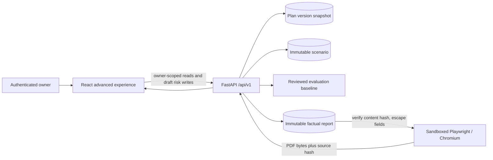

# Phase 12 Visualization and PDF Architecture

Status: accepted for Phase 12

Scope: dependency graph, timeline/Gantt, risk register, scenario comparison,
evaluation dashboard, and factual PDF export

## Architectural boundaries

Phase 12 presents and exports trusted application results. It does not add a new
agent workflow, give the model a browser or file-system tool, or permit a
scenario, visualization, evaluation, or export to mutate an active plan.

The implementation preserves four boundaries:

1. Dependency, schedule, risk severity, scenario deltas, and evaluation scores
   are calculated by application code.
2. Visualizations consume persisted plan or scenario data through owner-scoped
   REST APIs.
3. Every visual has a semantically equivalent table or list that remains usable
   with a keyboard, screen reader, reduced motion, and without color.
4. PDF bytes are rendered from a verified immutable report snapshot. Project
   text is escaped, JavaScript is disabled, and the Chromium context cannot
   access the network.

## Dependency decisions

| Component | Selected approach | Purpose | Alternatives considered | University-version necessity | Operational cost and fallback |
|---|---|---|---|---|---|
| Dependency graph | `@xyflow/react`, loaded only on the intelligence route | Pan/zoom overview, edge direction, selected-node context | Custom SVG; Cytoscape | Required for the professional full-version experience, not the MVP | Adds a lazy frontend chunk and periodic dependency review. The complete dependency table is always available if the graph fails or is unsupported. |
| Timeline/Gantt | Application-owned CSS grid and semantic HTML | Display persisted planned dates, milestone grouping, and current schedule | Frappe Gantt; Highcharts Gantt | Required in Phase 12, not the MVP | No new runtime dependency or license. The schedule table is authoritative and remains available on narrow viewports. |
| PDF rendering | Python Playwright using pinned Chromium | Reuse the tested browser engine and print CSS for full-version reports | WeasyPrint; wkhtmltopdf; native PDF composition | Required only for the full university version | Browser installation increases the backend image and CI time. Markdown remains the recovery export if rendering is unavailable. |
| Evaluation dashboard | Bundled, reviewed JSON baseline read through an authenticated API | Expose fixture scores, thresholds, provenance, and release status | Persist every run in PostgreSQL; static frontend JSON | Dashboard is required in Phase 12; persistence is optional in the plan | No migration or retention burden. A later phase may persist provider-backed runs without changing the response contract. |

React Flow is isolated behind `React.lazy`, so project intake, planning,
execution, and reports do not download it. The table alternative is not a
degraded error screen: it is rendered from the same task and dependency arrays
and exposes predecessor, successor, reason, and confidence.

## Data flow

The graph, timeline, and risk register share a selected `PlanGraphView`.
Scenario comparison reads a persisted `ScenarioView`; it never reconstructs or
changes the baseline in the browser. The evaluation endpoint returns a reviewed
baseline identified by a stable dataset version and SHA-256 hash.

## PDF rendering contract

Input:

- owner-authorized `Report` row;
- persisted `data_json`, `narrative_json`, Markdown, and `content_hash`;
- configured timeout and maximum output size.

Validation and isolation:

1. Recalculate the canonical report hash before launching Chromium. A mismatch
   is a conflict and produces no PDF.
2. Build HTML only from escaped stored fields; do not interpret stored Markdown
   as HTML and do not accept URLs, templates, or file paths from the request.
3. Start a fresh browser context with JavaScript disabled, service workers
   blocked, downloads disabled, and all HTTP(S) requests aborted.
4. Use only inline print CSS. Chromium receives no authentication state,
   application cookies, environment variables, or project-controlled command
   arguments.
5. Enforce the configured 60-second renderer upper bound and a bounded
   in-process concurrency limit. The report-PDF HTTP route receives that bound
   plus five seconds of response grace; unrelated routes retain the ordinary
   request timeout.
6. Reject output that is empty, not a PDF, or exceeds the configured byte limit.
7. Return `X-Report-Content-Hash` so a caller can bind the file to the immutable
   report representation.

Successful and failed exports create safe audit/telemetry records. Failure never
changes the report and the existing Markdown endpoint remains available.

## Accessibility contract

- Primary flows satisfy WCAG 2.2 AA automated checks with no serious
  violations.
- Graph nodes are selectable by keyboard, but no graph-only action exists.
- Every edge is present in a captioned dependency table.
- Timeline bars include text labels and dates; the accompanying table provides
  the same start, finish, duration, milestone, and status information.
- Risk severity is shown with text and score, not color alone.
- Scenario deltas use explicit “increased”, “decreased”, or “unchanged” labels.
- Charts use `aria-label` summaries and adjacent data tables.
- Loading, empty, error, stale-version, and permission states retain headings
  and recovery actions.
- Motion honors `prefers-reduced-motion`; horizontal visualization overflow
  never causes page-level overflow at 360 px.

## Performance and failure behavior

- The graph and evaluation dashboard are route-level/lazy chunks.
- Layout input is bounded to the persisted plan limits. Node coordinates are
  deterministic and calculated in linear passes over the displayed DAG.
- A 1,000-task/3,000-edge deterministic backend recalculation remains below two
  seconds; the UI uses the table alternative and a summarized graph for plans
  above the interactive rendering threshold.
- Expensive PDF work is bounded and cannot block more than the configured
  renderer concurrency per API process.
- An unavailable visualization shows the equivalent table. An unavailable PDF
  renderer returns a retryable safe error and preserves Markdown. An invalid
  evaluation baseline fails closed rather than displaying partial scores as a
  passing release.

## Persistence decision

Phase 12 does not enable evaluation-result persistence. The plan explicitly
makes the metadata table conditional. The API reads a reviewed baseline shipped
with the application, verifies its shape and hash, and exposes it only to an
authenticated user. Provider-backed/nightly history can add a table later while
retaining the same response schema.

## Verification

The Phase 12 gate requires:

- API authorization tests for risks, evaluations, and PDF export;
- risk CRUD, concurrency, relation, and active-plan immutability tests;
- report-hash mismatch, network isolation, timeout, size, filename, and browser
  rendering tests;
- component tests for all five views, their loading/empty/error states, keyboard
  behavior, and semantic table parity;
- desktop and 360 px Playwright coverage, axe scans, and a reviewed visual
  snapshot;
- the existing 1,000-task/approximately 3,000-edge performance gate;
- full backend, frontend, browser, security, restore, and release-gate CI.
