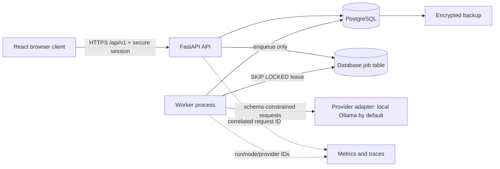

# MVP Architecture Review

Status: accepted for the Phase 10 release gate. Last reviewed: 2026-07-27.

## Runtime boundaries

The API is stateless except for opaque, hashed server-side sessions. Long-running work is
claimed by a separate worker through PostgreSQL leases. Planning, reporting, and monitoring
checkpoint after every node. The model can propose typed content but cannot authorize,
activate, schedule, calculate progress, validate graphs, or mutate an active plan.

## Invariants reviewed

- Every repository and service query is scoped to the authenticated owner.
- Draft approval locks the project and version, rechecks the content hash, and activates one
  immutable version transactionally.
- Required workflow-node failure cannot produce `completed`; restart resumes the last
  committed checkpoint.
- Idempotency binds owner, operation, key, and input hash. Same payload returns the original
  resource; a different payload returns 409.
- Task dependencies are plan-version local and validated as a DAG before persistence.
- Reports derive numeric facts from persisted state/events; recommendations require stored
  evidence. Unsupported narrative is rejected without discarding factual data.
- Provider calls use the adapter, strict output schemas, bounded context, timeout,
  usage capture, configurable model, and one bounded local schema-repair attempt.
- SQLite is a single-worker convenience only. PostgreSQL is authoritative for concurrency,
  constraints, migrations, and release verification.

## Dependency decisions

| Decision | MVP rationale | Alternative | Operational cost |
|---|---|---|---|
| FastAPI/Pydantic | Typed HTTP and AI boundaries | Django, Flask | Low; one Python service |
| SQLAlchemy/Alembic/PostgreSQL | Transactions, constraints, `SKIP LOCKED` | ORM-specific stack, hosted queue | One database and migrations |
| Database-backed jobs | Durable MVP execution without a broker | Celery/Redis | Worker polling and lease monitoring |
| React/Vite/TanStack Query | Typed, accessible application shell | Next.js, Vue | Static web container |
| Playwright Chromium | Existing E2E stack; future PDF reuse | Native PDF engine | Browser binary in test/full release |
| Provider adapters | Native Ollama keeps development local; OpenAI remains an optional portability boundary | Direct SDK calls in workflows | Ollama requires local compute; hosted providers require credentials and cost controls |

No unresolved Must-level architecture issue remains. Phase 11+ capabilities remain outside
the MVP boundary and cannot be reached through Phase 10 routes.
